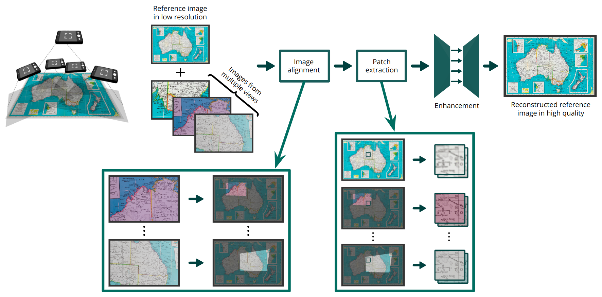
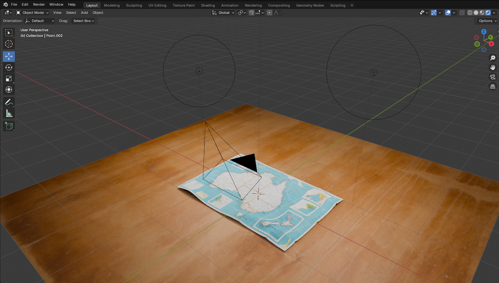
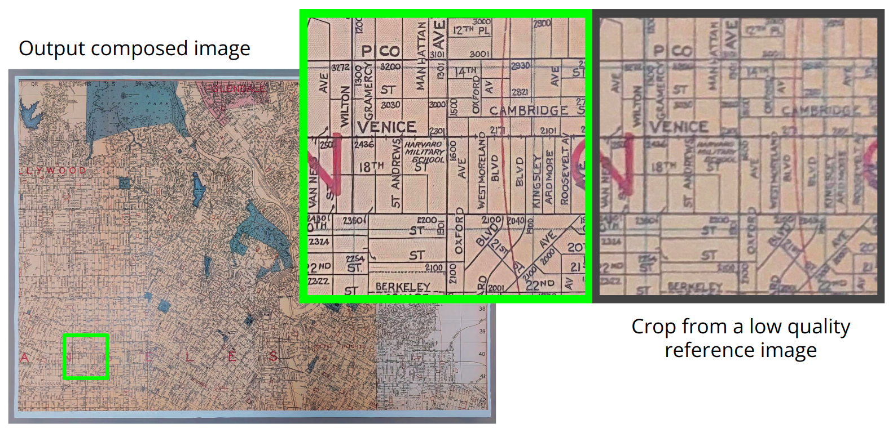
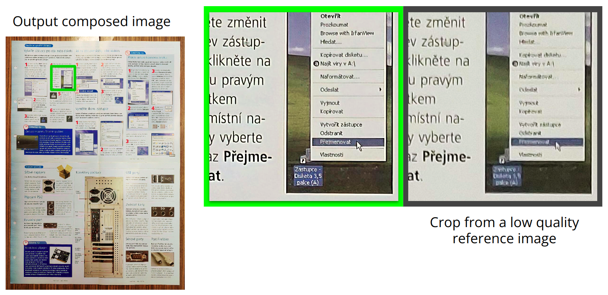
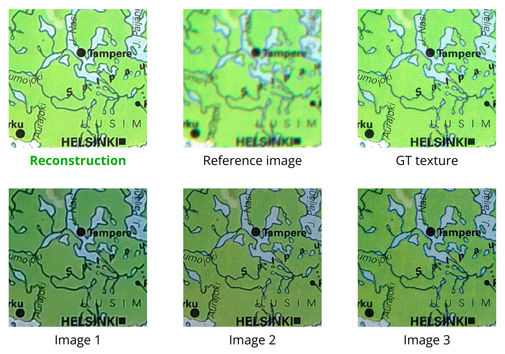
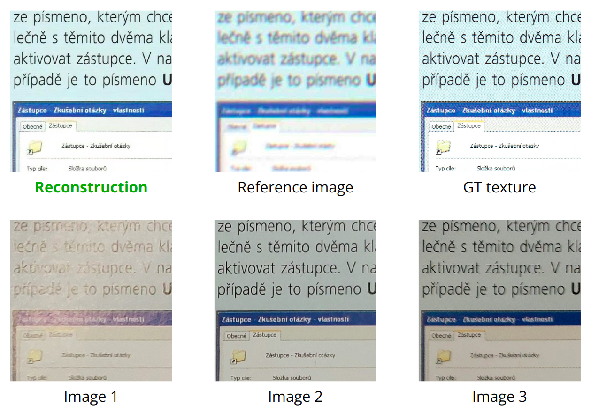

# Texture Reconstruction and Enhancement from Multiple Views
A deep learning-based pipeline for reconstructing high-resolution, seamless textures of large flat surfaces (such as maps, posters, or historical documents) from multiple variably lit views.

This project is organized into separate subdirectories to clearly define each processing step. This modular structure allows users to utilize only the components they need. Accordingly, each subdirectory contains its own `requirements.txt` file with libraries relevant for a specific task.




## Dataset generation
Files for dataset generation are located in the `blender_dataset_generator` directory. To use this, you must have [Blender](https://www.blender.org/) installed on your system. On Ubuntu-based systems, this can be done using `sudo apt install blender`. Before the generation process, you need to:
- Place your texture images in the `texture_images` directory.
- Place your surface images in the `surface_images` directory.

Then navigate to `blender_dataset_generator` and run the following command to generate a dataset using the parameterized setup defined in `main.py`:
```
blender -b main.blend -P main.py [-- --n_samples <optional_number_of_samples_to_generate>]
```




## Training pipeline
- **Data alignment** - `data_alignment/`
- **Extraction of patches** - `data_tiling/`
- **Training & enhancement** - `reconstruction/`
In each of these directories you have to install the specific packages using `python -m pip install -r requirements.txt` to use scripts belonging to that part.

Each input scene (set of frames and other data) must be in a separate directory and must include:
- `data.txt` file with the path to the original texture on the first line.
- `color_imgs` directory containing the camera images taken.

These files are automatically created when generating a dataset using the `blender_dataset_generator` scripts. 


### Step 1: Data Alignment
Synthetic data generated in Blender can be aligned using UV maps, which should be placed in `uv_imgs` directory within each scene folder. UV maps must follow the naming convention: `<image_name>_uv.exr`. These maps transform pixels into the ground truth (GT) texture space (or the degraded reference image space). To get a dataset of aligned images, run this command in `data_alignment`:
```
python get_aligned_dataset.py --data_path <path_to_a_dir_with_scenes> --texture_path <path_to_a_dir_with_textures> --output_path <path_to_aligned_data>
```

For real images (no UV maps available), homography + optical flow (SEA-RAFT via PTLFlow) alignment is used. It works the best with the `sea_raft_l` model trained on the `spring` dataset. The following configuration has shown the best results:
```
python get_aligned_dataset.py --data_path <path_to_a_dir_with_scenes> --texture_path <path_to_a_dir_with_textures> --output_path <path_to_aligned_data> --max_size_hg 2048 --hgof --max_size_of 1024 --patch_size 1024 --patch_stride 512 --model_name "sea_raft_l" --ckpt_path "spring"
```

### Step 2: Data Tiling
This stage extracts patches from aligned images for effective training. The script creates `image_patches`, `reference_patches`, and `texture_patches` directories with files named like `<image_name>_y_<patch_y_coord>_x_<patch_x_coord>.jpg`. `info.json` file will store metadata such as original image sizes and configuration parameters. Reference patches are extracted from a degraded version of the GT texture. Degradation parameters can be customized using a YAML config file (default: `config/degradation_config_default.yaml`), or overridden using `--degradation_config` parameter. Recommended settings are `patch_size 512` and `patch_stride 512`, which were later used for the training.
```
python extract_patches.py --data_dir <path_to_aligned_scenes> --output_dir <path_to_an_output_dir> --patch_size <patch_size> --patch_stride <patch_stride>
```

### Step 3: Training
To train the reconstruction model, use the `train.py` script. Supported model types (`<model_type>`) include:
- `RESNET34_UNET` – ResNet34_U-Net
- `MITB4_UNET` – MiTB4_U-Net
- `WF_RESNET34_UNET` – WF_ResNet34_U-Net
- `MV_EDSR` – MV_EDSR
- `RESNET101_UNETPLUSPLUS` – ResNet101_UNet++
```
python train.py --data_train <path_to_train_data> --data_val <path_to_val_data> --output_dir <output_dir> --model_type <model_type> [--checkpoint_path <trained_pth_checkpoint_path>] --num_views <number_of_views> --input_resolution <-1_to_keep> --batch_size <batch_size> --learning_rate <lr> --num_epochs <num_epochs> --num_workers <num_parallel_workers>
```


## Scripts for experiments and inference

### Create a degraded reference view from a GT texture
To be able to evaluate the PSNR and SSIM metrics, the images must be aligned to a reference image derived from the texture, which will be used for comparison: 
```
python degrade_image.py --input_image <path_to_a_texture> --output_image <path_to_output_reference_image> [--degradation_config <optional_config_path>]
```

### Compute theoretical maximum PSNR/SSIM values ​​from input images
Estimates achievable reconstruction quality by selecting best-matching patches from given views relative to a GT texture composed without the use of blending.
```
python evaluate_views.py --images_dir <path_to_a_dir_with_aligned_images> --texture_image <path_to_a_texture> --output_dir <dir_for_output_images> --patch_size <patch_size_7+>
```

### Align photos
Real-world photographs can be aligned using `data_alignment/align_photos.py`. Ensure that dependencies in `data_alignment/requirements.txt` are installed. The first image (alphabetically) will be used as the reference. The script aligns remaining images via homography and optical flow. Parameter `--max_image_size -1` will keep the reference image size. Recommended configuration:
```
python align_photos.py --scene_path <path_to_a_dir_with_images> --output_path <output_dir_path> --model_name "sea_raft_l" --ckpt_path "spring" --max_image_size <aligned_image_size> --patch_size 1024 --patch_stride 512 --max_size_of 1024 --max_size_hg 2048
```

### Texture reconstruction and enhancement
The final reconstruction (enhancement) of the texture from aligned multi-view inputs using a trained CNN model can be performed using `reconstruction/test.py`. If the GT texture is available, the script will also compute reconstruction quality using PSNR and SSIM metrics. Parameter `<number_of_views>` must match the number the model was trained on, which is 6 by default. If the script is used for comparing the result to GT texture, `<max_image_resolution> -1` will ensure matching the size of the texture on both input and output.
```
python test.py --imgs_path <path_to_aligned_images> --gt_texture <path_to_gt_texture> --output_path <output_enhanced_image_path> --checkpoint_path <path_to_a_model_checkpoint> --num_views <number_of_views> --max_image_size <max_image_resolution> --patch_size <patch_size> --patch_stride <patch_stride> --num_workers <num_parallel_workers> --model_type <model_type>
```


## Example enhancement results

### Output images compared to the reference images 



### Detail comparison of patches




## References
- **PTLFlow**: PyTorch Lightning Optical Flow [GitHub](https://github.com/hmorimitsu/ptlflow)
- **SEA-RAFT**: Simple, Efficient, Accurate RAFT for Optical Flow [GitHub](https://github.com/princeton-vl/SEA-RAFT) [Paper](https://arxiv.org/abs/2405.14793)


## Citation
This project was developed as part of the author’s Master's thesis. If you use this project in your research, please cite the following thesis:

KEDRA, David. _Rekonstrukce textury z více pohledů._ Brno, 2025. Diplomová práce. Vysoké učení technické v Brně, Fakulta informačních technologií. Vedoucí práce Ing. Michal Hradiš, Ph.D.

### BibTeX
```bibtex
@mastersthesis{kedra2025reconstruction,
  title        = {Rekonstrukce textury z více pohledů},
  author       = {David Kedra},
  year         = {2025},
  school       = {Brno University of Technology, Faculty of Information Technology},
  type         = {Diplomová práce},
  address      = {Brno, Czech Republic},
  note         = {Supervisor: Ing. Michal Hradiš, Ph.D.}
}
